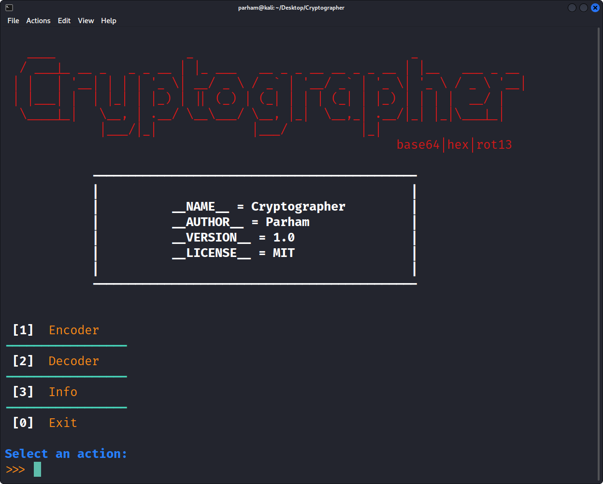

# Cryptographer
## **For Encrypting and Decrypting**
* Written 100% in Python
* Easy to install
* Offline
* Tested on common operating systems
---
## Supported Methods
* Base64
* Hex
* Rot13
---
## Tested On
- Linux (Kali)
- Windows (Windows 10)
- MacOS (macOS Big Sur)
---
## How To Install
1. `git clone https://github.com/parhamTheDeveloper/Cryptographer.git`
2. `python -m pip install -r requirements.txt` or `python3 -m pip install -r requirements.txt`
3. `cd Cryptographer`
4. `python main.py` or `python3 main.py`
